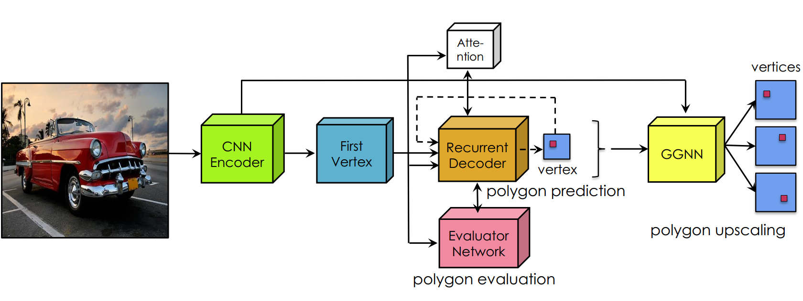

# PolygonRNN++

This is the official repository for the Polygon-RNN++ project (CVPR-2018). For technical details, please refer to:  

**Efficient Interactive Annotation of Segmentation Datasets with Polygon-RNN++**  
[David Acuna](http://www.cs.toronto.edu/~davidj/)\*, [Huan Ling](http:///www.cs.toronto.edu/~linghuan/)\*, [Amlan Kar](http://www.cs.toronto.edu/~amlan/)\*, [Sanja Fidler](http://www.cs.toronto.edu/~fidler/) (\* denotes equal contribution)   
CVPR 2018  
**[[Paper](https://arxiv.org/abs/1803.09693)] [[Video](https://www.youtube.com/watch?v=OH4MfeKkSyE)] [[Project Page](http://www.cs.toronto.edu/polyrnn/)]**  


### Usage
   1. Clone the repository 
   ```
   git clone https://github.com/davidjesusacu/polyrnn && cd polyrnn
   ```
   2. Install dependencies   
   (Note: Using a GPU (and tensorflow-gpu) is recommended. The model will run on a CPU, albeit slowly.)
   ```
   virtualenv env
   source env/bin/activate
   pip install -r requirements.txt
   ```
   3. Download the pre-trained models and graphs (448 MB)  
   (These models were trained on the Cityscapes Dataset)
   ``` 
   ./models/download_and_unpack.sh 
   ```
   4. Run demo\_inference.sh
   ```
   ./src/demo_inference.sh 
   ```
   This should produce results in the output/ folder that look like
   
    

### Walkthrough
   Checkout the ipython [notebook](src/demo_polyrnn.ipynb) that provides a simple walkthrough demonstrating how
   to run our model on sample input image crops

### Coming Soon
   * Online Demo
   * Training Code


If you use this code, we request you to cite:

    @article{acuna2018efficient,
    title={Efficient Interactive Annotation of Segmentation Datasets with Polygon-RNN++},
    author={Acuna, David and Ling, Huan and Kar, Amlan and Fidler, Sanja},
    booktitle={CVPR},
    year={2018}
    }

    @inproceedings{CastrejonCVPR17,
    title = {Annotating Object Instances with a Polygon-RNN},
    author = {Lluis Castrejon and Kaustav Kundu and Raquel Urtasun and Sanja Fidler},
    booktitle = {CVPR},
    year = {2017}
    }